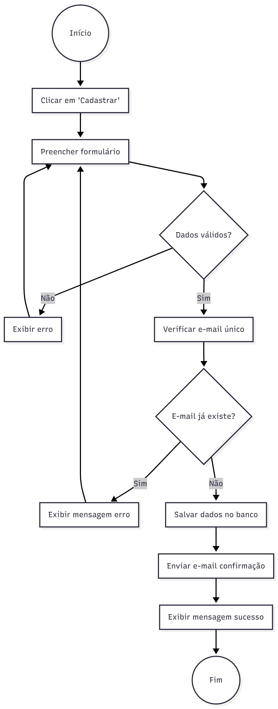

# Jornal Cidadão

#### Busca do segundo clique no site do Jornal do comércio

 
# Descrição do projeto

O projeto se consiste em uma intervenção no site do SJCC visando um maior engagamento e tempo de permanencia no site.

#Programação em Pares

A equipe decidiu não realizar a programação em pares devido principalmente à disponibilidade de horários distintos entre os membros do grupo. Tivemos dificuldades em encontrar horários em que todos pudessem estar presentes ao mesmo tempo, o que tornaria a prática mais demorada e complicada.

Além disso, percebemos que dividir as tarefas de forma individual e organizada trouxe maior produtividade e avanço mais rápido nas entregas. Cada membro teve como se concentrar em partes específicas do projeto de acordo com suas habilidades, o que facilitou a execução e a integração final do código.

# Documentação da API

[link do docs](./docs.md)

# Ferramentas e Tecnologias

- Trello e Miro: Gestão do projeto e Brainwriting
- Figma: Prototipação de alta fidelidade
- Golang e Gin: Linguagem e framework para implementaçao do backend
- HTML e CSS: Criaçao de paginas do frontend

### Trello: https://trello.com/b/gAzfJzpM/grupo-6-projeto
### Figma: https://www.figma.com/design/drRbNAHoTNeLXgQbNmiNF8/Projeto-JC?node-id=0-1&t=5ofTcdFJieug9wfu-1

# Status do Projeto

✅ Identificação do Problema;  
✅ Escolha da solução;   
✅ Prototipação;  
✅ Início do desenvolvimento;  
✅ Teste das funcionalidades;  
⌛ Entrega do MVP;  

# Equipe

- Francisco de Amorim
- Guilherme Henrique
- Heitor Galindo
- João Fernandes
- Lucas Florencio
- Lucas Fonteles
- Miguel Costa
- Renato Lopes

# Histórias de Usuario 

1. Visualizar Home
2. Cadastrar Usuário 
3. Aba de charges
4. Visualizar painel ADM
5. Gerenciamento de charge
6. Escrever e editar matéria
7. Visualizar matéria
8. Criar enquetes
9. Votar em enquetes
10. publicar noticia no Jornal Cidadão
11. Visualizar Noticia no JC
12. Notificação de status da publicação JC
13. Moderação de noticias do JC
14. Denunciar conteudo do JC
15. Reagir a notica do JC
16. Login usuário
    

#Sprints

1º Sprint
UH1 Visualizar Home
UH2 Cadastrar Usuário 
UH3 Aba de charges
UH4 Visualizar painel ADM
UH5 Gerenciamento de charge

2ª Sprint
UH6 Escrever e editar matéria
UH7 Visualizar matéria
UH8 Criar enquetes
UH9 Votar em enquetes

3ª Sprint
UH10 publicar noticia no Jornal Cidadão
UH11 Visualizar Noticia no JC
UH12 Notificação de status da publicação JC
UH13 Moderação de noticias do JC

4ª Sprint
UH14 Denunciar conteudo do JC
UH15 Reagir a notica do JC
UH16 Login usuário

#Quadro do trello atualizado

# Diagrama de atividades por UH

UH1 

UH2 

UH3 

UH4

UH5

UH6

UH7

UH8

UH9

UH10

UH11

UH12

UH13

UH14

UH15

UH16

