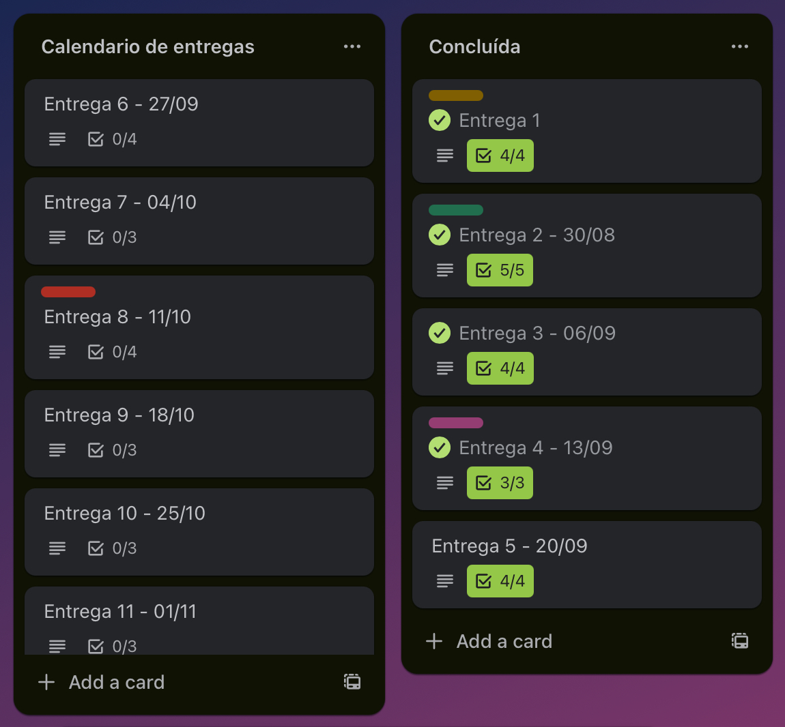

# Jornal Cidadão

#### Busca do segundo clique no site do Jornal do comércio

 
# Descrição do projeto

O projeto se consiste em uma intervenção no site do SJCC visando um maior engagamento e tempo de permanencia no site.

# Ferramentas e Tecnologias

- Trello e Miro: Gestão do projeto e Brainwriting
- Figma: Prototipação de alta fidelidade
- Golang e Gin: Linguagem e framework para implementaçao do backend
- HTML e CSS: Criaçao de paginas do frontend

### Trello: https://trello.com/b/gAzfJzpM/grupo-6-projeto
### Figma: https://www.figma.com/design/drRbNAHoTNeLXgQbNmiNF8/Projeto-JC?node-id=0-1&t=5ofTcdFJieug9wfu-1

# Status do Projeto

✅ Identificação do Problema;  
✅ Escolha da solução;   
✅ Prototipação;  
⌛ Início do desenvolvimento;  
⌛ Teste das funcionalidades;  
⌛ Entrega do MVP;  

# Equipe

- Francisco de Amorim
- Guilherme Henrique
- Heitor Galindo
- João Fernandes
- Lucas Florencio
- Lucas Fonteles
- Miguel Costa
- Renato Lopes

# Histórias de Usuario 

1. Cadastrar Usuário 
1. Login de Usuário 
1. Aba de charges
1. Gerenciamento de charges
1. Criar enquetes
1. Votação na enquete
1. Publicar notícias
1. Moderação de notícias
1. Notificação de status da publicação 
1. Visualizar notícias dos usuários
1. Reagir a notícias
1. Denunciar conteúdos

# Quadro de sprints

# Diagrama de atividades

